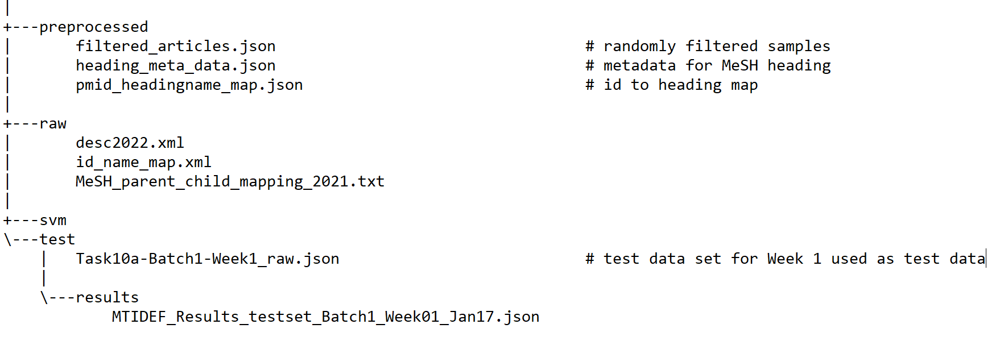

# GNN Link Prediction 

Create new virtual environment if necessary

```
python -m venv .venv
```
Python version: 3.10


Once environment is activated use following command to install required packages.

```bash
pip install -e .
``` 

```bash
pip install -r requirements.txt
```

`data` folder can be downloaded from [here](https://drive.google.com/drive/folders/17HQiKmJEW8L3wetQO-BL8eWLU3LxNdf_?usp=share_link)

It should contain following files:



## Preprocessing

Following command prepares required embeddings.

```bash
python src/preprocessing.py
```

Following command prepares datasets and creates negative edges before training so that the same edges can be used for different runs. 

```bash
python src/graph_preparation.py
```

## Training 

Train GNN model. BCE or Focal Loss

```bash
python gnn.py
```

Train GNN with Dynamic Random sampling

```bash
python gnn_drs.py
```

Train GNN with mixup

```bash
python gnn_mixup.py
```

